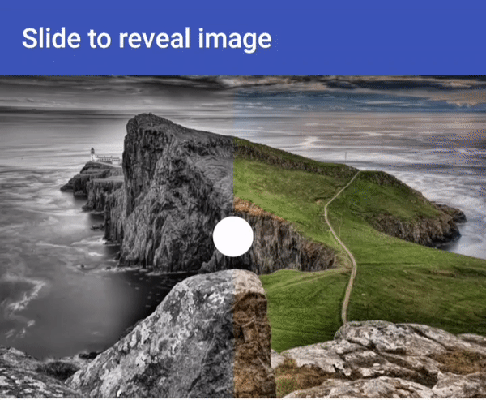

# <h1 align="center">Before and after image slider</h1>
<p align="center">
  
</p>

```java
  <it.marcomirisola.SlideToRevealImage
        android:id="@+id/mySlider"
        android:layout_width="match_parent"
        android:layout_height="300dp"
        app:slider_thumb="@mipmap/white_circle" 
        />
```

```kotlin
  //Inside java
  
  mySlider.setBeforeImage(imgUrl1).setAfterImage(imgUrl2)  
```

```kotlin
  //to change slider_thumb programmaticaly
  mySlider.setSliderThumb(yourDrawable)
```

```xml  
  <!--  to set images from xml  -->
  app:before_image="@mipmap/image1"
  app:after_image="@mipmap/image2"
```

<h1>Gradle dependency</h1>

```groovy        
//add this to your top level build.gradle file
  maven { url 'https://jitpack.io' }
      
//and add this to your module level build.gradle file
 implementation 'com.github.MarcoMirisola:SlideToRevealImage:v2.0'

```
The library uses Glide for image loading

<h2> This project is heavy based from <a href="https://github.com/developer--/before_after_slider"> before_after_slider  from @developer--</a> </h2>

<h1><a href="https://github.com/ioramashvili/BeforeAfterSlider"> iOS version</a> </h1>
